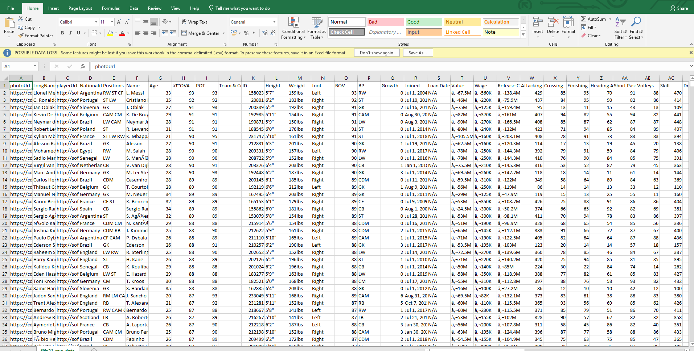
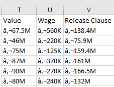
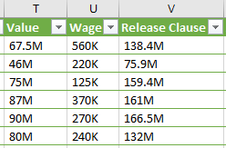
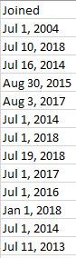
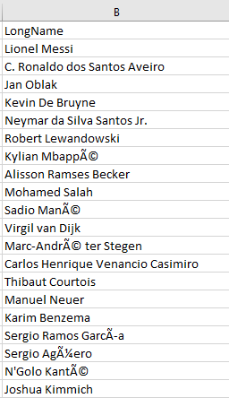
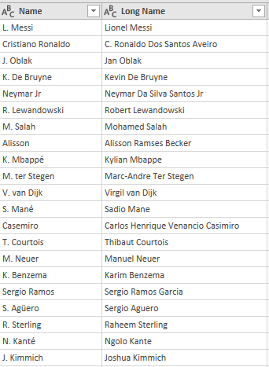
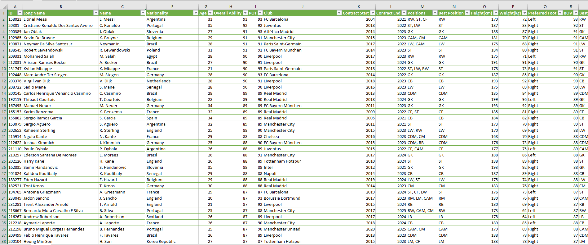

# FIFA 21 Data Cleaning Challenge 

## Introduction

The challenge which has now been documented as a project started out from Twitter when Chinonso Promise (@PromiseNonso_) came up with the idea of data cleaning on the app, and also organized a space which included some other smart minds who threw more light on the possible tools that could be employed in cleaning the data to be used for the challenge. Datasets for this challenge were carefully researched by the organizers to ensure that a high quality of work must be put in before obtaining a presentable and analysable transformed dataset.  
Amongst a list of tools (SQL, Python, Microsoft Excel, Microsoft Power BI, etc), Excel and Power Query Editor, also known as Power Query (which can be accessed from Power Bi and Excel) were the preferred choices for this challenge, owing to their numerous functions that came in handy in cleaning the datasets.

**_Disclaimer_**: _The FIFA 21 image (just before the Introduction) was gotten from whatculture.com and has only been used for illustrative purposes._ 

## Skills Demonstrated

- 	Dataset merging 
- 	Column splitting 
- 	Duplicate removal
- 	Error elimination
- 	Table formatting

## Data Sourcing 

FIFA 21 raw datasets were sourced from [Kaggle](https://www.kaggle.com/datasets/yagunnersya/fifa-21-messy-raw-dataset-for-cleaning-exploring?select=fifa21_raw_data.csv). The messy datasets (two in number) consisted of the following columns and number of rows: 
### FIFA 21 Raw Dataset 1:
- 18,980 rows
- 77 columns 
### FIFA 21 Raw Dataset 2:
- 18,980 rows
- 77 columns
### Sample of One of the Raw Datasets

## Data Transformation/Cleaning

Cleaning and transformation of the datasets was done both on Excel and Power Query Editor. The different steps and functions employed have been detailed based on the tools used.
### Excel:
Using this tool, FIFA 21 Raw Dataset 1 was the first to be worked on as getting it right will give further insights on how the second dataset could be cleaned and transformed. The following steps were taken to transform the dataset on Excel:
- Blank cells were checked for by the ‘Go to Special' feature but no blank cells were found.
- ‘Remove Duplicates’ was done but just 1 duplicate value was found, and it was removed.
- ‘Format as Table’ to give a better design and appearance, and to clearly highlight the heading as well as include filters to the headings.
- The ‘Find and Replace’ feature was used to eliminate the “€” from the Value, Wage, and Release Clause columns by replacing “€” with nothing (blank space). This function was also used to replace “é” with “é” in the Long Name and Name columns. “ü” was replaced with “ü”. “Ô was replaced with “í”. “ín” replaced with “Án”. “ć” replaced with “ć”., and “Ä” was replaced with “ć”.

Value, Wage, Release Clause Columns (Before Transformation)   |  Value, Wage, Release Clause Columns (Partly Transformed)
:-----------------------------------------------------------: | :--------------------------------------------------:
                 |  

- The Joined column was converted into a date format by firstly splitting the text date into 3 separate columns (Day, Month, Year). 
-	Using the ‘RIGHT’ function, the year was extracted. 
-	‘LEFT’ function was used to extract the month, and the formula was expanded with the CONCATENATE operator (&) to add a space and ‘1’ to give the first of each month (so as to convert the month from text format to a number format where excel can easily interpret it), then a DATEVALUE function was used to convert to the numerical format of the date, while a MONTH function was used to extract the exact month value from the numbers. 
-	MID function was used to extract the days. In between the MID function formula, a FIND function was inserted too as some of the days had single values and others had double values.
-	A new column (Converted Date, which was later renamed as 'Joined' after the transformation) was used to merge the 3 date parts into 1 using the DATE function, which later became the properly formatted Joined date.
-	The Converted Date column was copied and repasted on the same column in order to retain its values and extract the formulas so that there will be no errors when deleting the wrongly formatted Joined column.

Joined Column (Before Transformation)        | Joined Column (After Transformation)
:------------------------------------------: | :---------------------------------:
 |  

- The Team & Contract column was expanded to include a comma as the delimiter using the formula:
=LEFT(J3,MIN(FIND({0,1,2,3,4,5,6,7,8,9},J3&"0123456789"))-1)&","&RIGHT(J3,LEN(J3)-MIN(FIND({0,1,2,3,4,5,6,7,8,9},J3&"0123456789"))+1). Through the comma, the column was separated into two columns; Team, and Contract. 
### Power Query Editor:
Having gotten an idea of what a clean dataset will look like for the first dataset, the Power Query editor was utilized as an upgrade and more automated tool, when compared to the Excel processes, due to its features. The following steps were applied right from the first point of loading the datasets from Excel into the Power Query Editor: 
- Combined and Transformed both datasets on Power Query, changed the File Origin to “65001: Unicode (UFT-8)” which transformed the rows of Player names and Club names that were wrongly spelt (and had irregular formats) into the correct format. This step alone was enough to save hours that could have been spent skimming and editing thousands of cells containing player names that were not coherent.
- From the Long Name column, another column (Name) was formed, with the cells containing the initials of the first name and other names from the respective cells, the “flash fill” feature automatically filled the rest of the cells in the Name column.

Long Name Column (Before Transformation)     |  Long Name Column (After Transformation)
:------------------------------------------: | :---------------------------------:
                     |  

- Next was; CTRL + A, then on the Transform menu; Format and Clean to keep the combined data clean. 
- Split the Contract column into Contract Start and Contract End columns, using “Split by Delimiter” function.

Contract Column (Before Transformation)                |  Contract Column (After Transformation)
:----------------------------------------------------: | :---------------------------------:
  |  

- For the columns (Height, Weight, Value, Wage) that have units in their cells, the units were deleted from the cells and added to the column name in parentheses.
- In all the columns with values (excluding Date columns), column type was changed to Decimal. For the Age column, the data type was selected as Whole Number. The Joined Date column (Data Type) was changed from Text to Date.
- Multiplied the Value column by 1,000,000, the Release column by 1,000,000 and the Wage column by 1,000.
- Edited the column headers and changed them from the short forms and abbreviations to the full column title.
- The entire combined table was selected and next function applied was remove blank rows.
- Changed the data type of the following columns (Attacking, Crossing, Finishing, Heading Accuracy, Shot Passing, Volleys, Sill, Dribbling, Curve, FK Accuracy, Long Passing, Ball Control, Movement, Acceleration, Sprint Speed, … and other player rating columns) to Decimal.
- OVA column was renamed as Overall Ability, and the column type was changed to percentage.
- Split the Contract column by Delimiter into Contract Start and Contract End.
- Multipled the Weight column by 2.20462 to convert the cell values from kg to lbs.
-	Dollar ($) was added as the unit of the Value, Wage, and Release Clause columns.
-	The Hits column (last column) was deleted because it wasn’t relevant to the analysis. Same as Loan Date End column.  
-	The Photo URL and Player Url columns were hidden to give a clearer apperance of the cleaned dataset at first glance. 
-	The Loan Date End column was hidden as it hadn’t enough information to be included in the further analysis. 

### Cleaned Dataset  

## Conclusion
-	Column splitting by delimiter was commonly used both in Excel and Power Query.
-	Power Query appears to be a faster tool in data cleaning, when compared with Excel although both tools share a lot of similarities and functions, it was easier to merge datasets on Power Query. 
-	Hiding columns on Excel has proved to be useful in giving the dataset a better pictorial appearance of the relevant details needed to be seen while still retaining the less relevant details which are not necessary when the data transformation has been completed.
-	Applying this process ‘Combined and Transformed both datasets on Power Query, changed the File Origin to “65001: Unicode (UFT-8)”’ on Power Query was the most time conserving move as it eliminated the time required to format the player names due to the large dataset.

## Recommendation
-	Datasets for 2022 and 2023 to be included to ensure that the data is up to date. This will give room for a more robust analysis of the athletes in terms of how they have evolved over the years from the start year of the data to this present year (2023).

